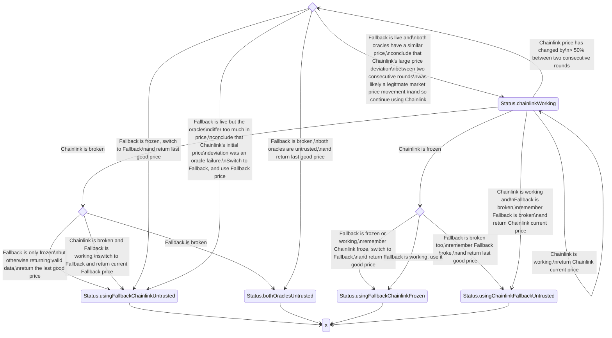

```mermaid
stateDiagram-v2
    state TryFallbackChainlinkBroken <<choice>>
    state TryFallbackChainlinkFrozen <<choice>>
    state CompareFallback <<choice>>
    Status.chainlinkWorking --> TryFallbackChainlinkBroken: Chainlink is broken
        TryFallbackChainlinkBroken --> Status.bothOraclesUntrusted: Fallback is broken
        TryFallbackChainlinkBroken --> Status.usingFallbackChainlinkUntrusted: Fallback is only frozen\nbut otherwise returning valid data,\nreturn the last good price
        TryFallbackChainlinkBroken --> Status.usingFallbackChainlinkUntrusted: Chainlink is broken and Fallback is working,\nswitch to Fallback and return current Fallback price
    Status.chainlinkWorking --> TryFallbackChainlinkFrozen: Chainlink is frozen
        TryFallbackChainlinkFrozen --> Status.usingChainlinkFallbackUntrusted: Fallback is broken too,\nremember Fallback broke,\nand return last good price
        TryFallbackChainlinkFrozen --> Status.usingFallbackChainlinkFrozen: Fallback is frozen or working,\nremember Chainlink froze, switch to Fallback,\nand return last good price
        TryFallbackChainlinkFrozen --> Status.usingFallbackChainlinkFrozen: Fallback is working, use it
    Status.chainlinkWorking --> CompareFallback: Chainlink price has changed by\n> 50% between two consecutive rounds
        CompareFallback --> Status.bothOraclesUntrusted: Fallback is broken,\nboth oracles are untrusted,\nand return last good price
        CompareFallback --> Status.usingFallbackChainlinkUntrusted: Fallback is frozen, switch to Fallback\nand return last good price
        CompareFallback --> Status.chainlinkWorking: Fallback is live and\nboth oracles have a similar price,\nconclude that Chainlink's large price deviation\nbetween two consecutive rounds\nwas likely a legitmate market price movement,\nand so continue using Chainlink
        CompareFallback --> Status.usingFallbackChainlinkUntrusted: Fallback is live but the oracles\ndiffer too much in price,\nconclude that Chainlink's initial price\ndeviation was an oracle failure.\nSwitch to Fallback, and use Fallback price
    Status.chainlinkWorking --> Status.usingChainlinkFallbackUntrusted: Chainlink is working and\nFallback is broken,\nremember Fallback is broken\nand return Chainlink current price
    Status.chainlinkWorking --> Status.chainlinkWorking: Chainlink is working,\nreturn Chainlink current price
    Status.usingFallbackChainlinkUntrusted --> x
    Status.bothOraclesUntrusted --> x
    Status.usingFallbackChainlinkFrozen --> x
    Status.usingChainlinkFallbackUntrusted --> x
```