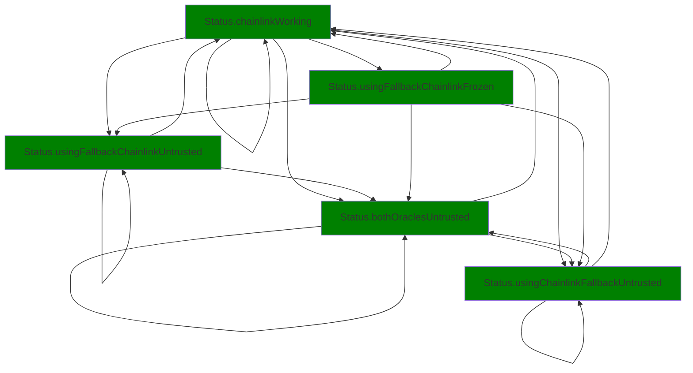

```mermaid
flowchart TD
    %% CASE 1
    Status.chainlinkWorking --> Status.bothOraclesUntrusted
    Status.chainlinkWorking --> Status.usingFallbackChainlinkUntrusted
    Status.chainlinkWorking --> Status.usingChainlinkFallbackUntrusted
    Status.chainlinkWorking --> Status.usingFallbackChainlinkFrozen
    Status.chainlinkWorking --> Status.chainlinkWorking

    %% CASE 2
    Status.usingFallbackChainlinkUntrusted --> Status.chainlinkWorking
    Status.usingFallbackChainlinkUntrusted --> Status.bothOraclesUntrusted
    Status.usingFallbackChainlinkUntrusted --> Status.usingFallbackChainlinkUntrusted

    %% CASE 3
    Status.bothOraclesUntrusted --> Status.usingChainlinkFallbackUntrusted
    Status.bothOraclesUntrusted --> Status.chainlinkWorking
    Status.bothOraclesUntrusted --> Status.bothOraclesUntrusted

    %% CASE 4
    Status.usingFallbackChainlinkFrozen --> Status.bothOraclesUntrusted
    Status.usingFallbackChainlinkFrozen --> Status.usingFallbackChainlinkUntrusted
    Status.usingFallbackChainlinkFrozen --> Status.usingChainlinkFallbackUntrusted
    Status.usingFallbackChainlinkFrozen --> Status.chainlinkWorking

    %% CASE 5
    Status.usingChainlinkFallbackUntrusted --> Status.bothOraclesUntrusted
    Status.usingChainlinkFallbackUntrusted --> Status.chainlinkWorking
    Status.usingChainlinkFallbackUntrusted --> Status.usingChainlinkFallbackUntrusted

    style Status.chainlinkWorking fill:green
    style Status.usingFallbackChainlinkUntrusted fill:green
    style Status.bothOraclesUntrusted fill:green
    style Status.usingFallbackChainlinkFrozen fill:green
    style Status.usingChainlinkFallbackUntrusted fill:green
```